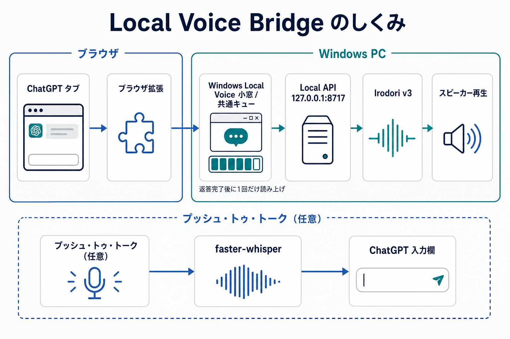

# Local Voice Bridge

[](https://github.com/misaka310/local-voice-bridge/actions/workflows/ci.yml)

chatgpt.comにローカル音声読み上げと、任意のプッシュ・トゥ・トーク音声入力を追加するWindows向けの非公式補助ツールです。読み上げだけでも利用でき、マイク会話機能は初期状態でオフです。

> **非公式・非提携について**
> このプロジェクトは独立して開発された非公式ツールであり、OpenAIの公式製品、提携製品、承認製品、スポンサー製品ではありません。ChatGPT、OpenAIおよび関連する名称・商標は各権利者に帰属します。

<p align="center">
  
</p>

ChatGPTの返答検出からローカル音声生成・再生、任意のプッシュ・トゥ・トーク入力までの経路を示しています。

https://github.com/user-attachments/assets/55580bbe-1325-4548-a03b-d70f7004a7fb

再生ボタンから、ChatGPTの新しい返答を自動で読み上げる流れを映像と音声で確認できます。

映像は実ChatGPTアカウントではなく、安全なローカルフィクスチャで実際の拡張機能コードを動かしています。ローカル音声生成エンジンにはIrodori v3を使用しています。

## 主な機能

- Autoをオンにした後の新しいChatGPT返答だけを、完了確認後にローカル音声で読み上げ
- 空の新規会話、回答生成中、完了未確認、明るい緑のスピーカーで示す読み上げ処理中、ChatGPTのテキスト回答生成エラーを、競合時にも点滅させない静的faviconで区別
- 開いている複数タブの返答を1つの共通キューで管理し、`Next`・`Replay`・`Regen`で操作
- API、生成音声、任意の参照音声を同じPC内で管理し、通常利用ではターミナルを表示しない
- 任意のマイク会話モードでは、キーを押している間だけ録音し、ローカルfaster-whisperでChatGPT入力欄へ送信
- 対応するYouTube Dictation Pause Controlと連携し、録音中だけYouTubeを停止・再開
- 実モデルやChatGPTログイン不要のデモとCIで、拡張機能・キュー・再生境界を確認可能

細かなキュー制御、入力先固定、キャンセル猶予、割り込み条件、デスクトップペットの操作は[操作と検証](docs/operation.md)にまとめています。faviconの優先順位と30タブ向けの低負荷設計は[タブ状態と30タブ向け低負荷設計](docs/tab-status-and-resource-design.md)を参照してください。

## GPU不要の2分デモ

```bat
npm ci
npx playwright install chromium
npm run demo
```

Node.js 22とChromiumだけで起動します。Python、CUDA、GPU、Hugging Faceモデル、ChatGPTへのログインは不要です。表示される画面は「ローカルデモフィクスチャ」であり、実ChatGPT画面ではありません。終了時はChromiumを閉じるか`Ctrl+C`を押してください。

終了コードで検証する場合：

```bat
npm run demo:check
```

## Setup / 初回セットアップ

初回だけ次を実行します。

```bat
setup-voice-env.cmd
```

小型セットアップ画面が開き、次の3種類から選べます。通常は**読み上げのみ**を選択してください。

| 選択 | 内容 | 推定ダウンロード | 必要な空き容量 |
| --- | --- | ---: | ---: |
| 読み上げのみ | Irodori v3、CUDA版PyTorch、FFmpeg、Windows小窓 | 約8〜14 GB | 約15〜25 GB |
| 読み上げ + マイク会話 | 上記 + faster-whisper、録音依存 | 約8〜17 GB | 約18〜29 GB |
| 開発者向け（通常は不要） | 上記 + npm、Playwright、Windows GUIスモーク依存 | 約9〜19 GB | 約20〜33 GB |

工程ごとの成功・失敗・失敗コードを画面に表示します。完了済み工程は`local-api/runtime/setup/state.json`へ記録されるため、途中失敗後の再実行は失敗工程から再開します。詳細ログは`local-api/runtime/setup/setup.log`です。

## Usage / 起動と操作

1. Windows検索で`Local Voice Bridge`を開くか、リポジトリ直下の`LocalVoiceBridge.exe`を実行します。
2. `http://127.0.0.1:8717/health`で`ok=true`と`engine=irodori_direct`を確認します。
3. [拡張機能の導入・更新手順](extension/INSTALL.md)に従い、Chrome / Braveへ`extension/`を読み込みます。
4. Windows Local Voice小窓でAutoをオンにし、ChatGPTへ新しいメッセージを送ります。返答完了後に先頭プレビューが一度だけ再生されれば準備完了です。

読み上げ量や文字起こしモデルは拡張機能の`オプション`、Auto・参照音声・マイク会話はWindows小窓から設定します。マイク会話を使う場合はセットアップで追加機能を導入し、送信先の入力欄へフォーカスして指定キーを押している間だけ録音します。

詳細な操作、YouTube連携、音声・ログの自動整理、アンインストール、診断方法は[操作と検証](docs/operation.md)、[参照音声](docs/reference-audio.md)、[起動とヘルス確認](docs/startup.md)を参照してください。

## Requirements / 対応環境

| モード | 必須 | 検証済み | 未対応・未検証 |
| --- | --- | --- | --- |
| 軽量デモ / mock CI | Node.js 22、Chromium | Windows 11のPlaywright Chromium | Firefox、macOSの実行は未検証 |
| 実音声 | Windows、Python、NVIDIA GPU、CUDA、Irodori v3 | Windows 11、Windows外部小窓、Playwright Chromium、NVIDIA CUDA環境 | CPUのみ、macOS、Linux、Firefox、Edgeは未検証または未対応 |

GPU、VRAM、ブラウザごとの扱いは[動作環境](docs/hardware.md)にまとめています。未検証の環境を対応済みとはしていません。

## Verification / 動作確認

セットアップ画面で`開発者向けの項目を表示`を有効にした場合だけ、開発者向けセットアップを選択できます。開発者向けでは次を実行します。

```bat
npm run test:python
npm run test:background
npm run test:e2e:mock
npm run check:public
```

`test:background`は、Service Workerの全タブ共通キュー、外部設定・コマンド同期、参照音声正規化、loopback音声URL制限、バイナリ変換を検証し、`background-core.js`へ95%のline coverageを要求します。通常起動の確認は、通知領域、Windows Local Voice小窓、`http://127.0.0.1:8717/health`の`ok=true`を使用します。ペットのダブルクリックを含むWindows実画面確認手順は[起動とヘルス確認](docs/startup.md)にあります。

## Limitations / 制約

- ChatGPTのDOM変更により、返答検出が一時的に動作しなくなる可能性があります。
- CIはChatGPTに似た固定フィクスチャを使い、将来の実ChatGPT DOMを保証しません。
- 軽量デモは統合動作の確認用で、Irodoriの音声品質評価ではありません。
- 実モデルE2EにはWindows、NVIDIA GPU、CUDA、モデル取得が必要です。
- ローカルAPIには認証がないため、LAN、インターネット、トンネルへ公開できません。

## 詳細ドキュメント

- [初回セットアップ](docs/setup.md)
- [起動とヘルス確認](docs/startup.md)
- [操作とテスト](docs/operation.md)
- [タブ状態と30タブ向け低負荷設計](docs/tab-status-and-resource-design.md)
- [動作環境](docs/hardware.md)
- [困ったとき](docs/troubleshooting.md)
- [参照音声](docs/reference-audio.md)
- [セキュリティ境界](SECURITY.md)
- [構成](ARCHITECTURE.md)
